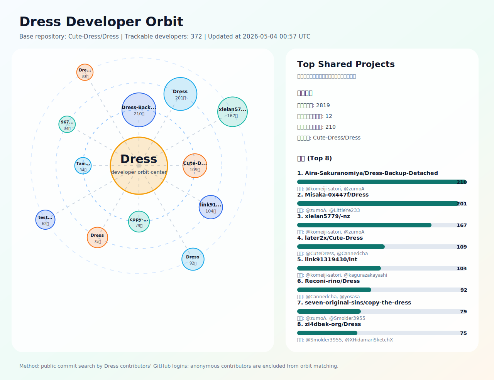

# Dress-Orbit
GitHub项目相关性调查

---

一项有趣的Github项目之间的相关性调查, 仅分析重叠的贡献者并统计他们的提交次数.
本项目无意针对任何个人, 仅供社区分析数据和学习.

<!-- ANALYSIS_START -->
## 分析结果

> 最后更新：2026-03-23 09:48 UTC

> 说明：项目共现基于 Dress 的可独立追踪开发者（GitHub 登录名），通过 GitHub 公开提交检索反查其参与过的公开仓库。匿名身份会计入 Dress 贡献者总量，但无法跨仓库稳定追踪。

### Dress 开发者扫描概况

| 指标 | 数值 |
|:--|--:|
| 基准仓库 | [Cute-Dress/Dress](https://github.com/Cute-Dress/Dress) |
| 贡献者总数（含匿名） | 575 |
| 可匹配身份贡献者数（登录名或匿名署名） | 573 |
| 可独立追踪开发者数（GitHub 登录） | 368 |
| 匿名但可匹配身份数 | 205 |
| 发现的共现项目数 | 2837 |
| 每位开发者检索页数 | 1 |
| 排除镜像疑似项目数 | 0 |
| 镜像检测范围（Top N） | 160 |
| 镜像判定阈值（score >=） | 3 |

### Orbit 图

### 共同贡献最多的项目

| 项目 | 共同开发者数 | 这些开发者在 Dress 的提交数 | Stars | 示例开发者 |
|:--|--:|--:|--:|:--|
| [Aira-Sakuranomiya/Dress-Backup-Detached](https://github.com/Aira-Sakuranomiya/Dress-Backup-Detached) | 214 | 771 | 50 | @zumoA, @komeiji-satori, @XHidamariSketchX, @M0xkLurk3r, @LittleYe233, @Smolder3955 |
| [Misaka-0x447f/Dress](https://github.com/Misaka-0x447f/Dress) | 208 | 708 | 55 | @zumoA, @XHidamariSketchX, @M0xkLurk3r, @LittleYe233, @Smolder3955, @flowerfanfan |
| [xielan5779/-nz](https://github.com/xielan5779/-nz) | 173 | 669 | 0 | @zumoA, @komeiji-satori, @BBleae, @XHidamariSketchX, @M0xkLurk3r, @Smolder3955 |
| [later2x/Cute-Dress](https://github.com/later2x/Cute-Dress) | 109 | 287 | 0 | @CuteDress, @Cannedcha, @KagurazakaYuri, @yosasa, @TigerCOOI, @Koishi-Komeiji-github |
| [link91319430/int](https://github.com/link91319430/int) | 107 | 784 | 0 | @akinazuki, @kagurazakayashi, @zumoA, @komeiji-satori, @BBleae, @XHidamariSketchX |
| [Reconi-rino/Dress](https://github.com/Reconi-rino/Dress) | 93 | 231 | 351 | @Cannedcha, @KagurazakaYuri, @yosasa, @Koishi-Komeiji-github, @MoeAya, @1332881954 |
| [seven-original-sins/copy-the-dress](https://github.com/seven-original-sins/copy-the-dress) | 81 | 301 | 0 | @zumoA, @XHidamariSketchX, @Smolder3955, @YueerMoe, @jshensh, @MyTrancy |
| [zi4dbek-org/Dress](https://github.com/zi4dbek-org/Dress) | 78 | 240 | 0 | @XHidamariSketchX, @Smolder3955, @MyTrancy, @yosasa, @justghostof, @HinataKato |
| [Pluto-xx/test-dress](https://github.com/Pluto-xx/test-dress) | 68 | 192 | 0 | @Smolder3955, @yosasa, @justghostof, @Koishi-Komeiji-github, @MoeAya, @1332881954 |
| [967149552/-](https://github.com/967149552/-) | 35 | 102 | 0 | @yosasa, @Koishi-Komeiji-github, @MoeAya, @LindoEri, @nomanomako, @RapeCat |
| [yzjdxfss/TamakinJoSou](https://github.com/yzjdxfss/TamakinJoSou) | 34 | 148 | 6 | @zumoA, @XHidamariSketchX, @jshensh, @G4Y8u9, @yuuko-eth, @yosasa |
| [Pasyware/DressTycoon](https://github.com/Pasyware/DressTycoon) | 34 | 93 | 0 | @Koishi-Komeiji-github, @MoeAya, @LindoEri, @nomanomako, @RapeCat, @yinchao-qaq |
| [LGBT-CN/LGBTQIA-In-China](https://github.com/LGBT-CN/LGBTQIA-In-China) | 19 | 104 | 808 | @BBleae, @AyagawaSeirin, @AkinaHaruka, @Big-Cake-jpg, @justghostof, @miRoox |
| [project-trans/MtF-wiki](https://github.com/project-trans/MtF-wiki) | 8 | 25 | 1017 | @Dolyn157, @BingL-Li, @yinchao-qaq, @251nx, @AtomAlpaca, @artefaritaKuniklo |
| [cirosantilli/imagine-all-the-people](https://github.com/cirosantilli/imagine-all-the-people) | 7 | 26 | 3 | @sumimakito, @JinXJinX, @ann61c, @ice1000, @cw1997, @adzen |
<!-- ANALYSIS_END -->
