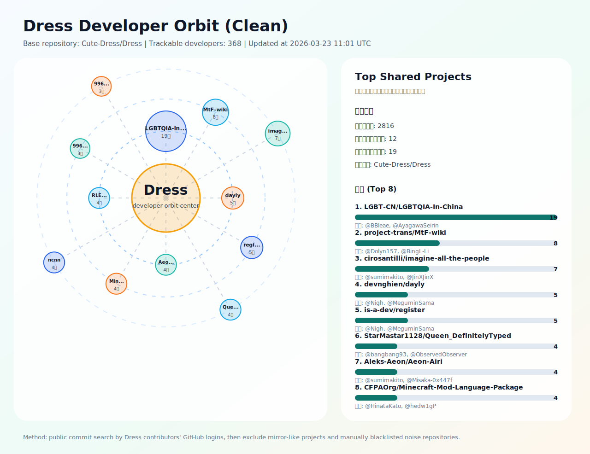

# Dress-Orbit
GitHub项目相关性调查

---

一项有趣的Github项目之间的相关性调查, 仅分析重叠的贡献者并统计他们的提交次数.
本项目无意针对任何个人, 仅供社区分析数据和学习.

<!-- ANALYSIS_START -->
## 分析结果

> 最后更新：2026-04-20 02:53 UTC

> 说明：项目共现基于 Dress 的可独立追踪开发者（GitHub 登录名），通过 GitHub 公开提交检索反查其参与过的公开仓库。匿名身份会计入 Dress 贡献者总量，但无法跨仓库稳定追踪。

### Dress 开发者扫描概况

| 指标 | 数值 |
|:--|--:|
| 基准仓库 | [Cute-Dress/Dress](https://github.com/Cute-Dress/Dress) |
| 贡献者总数（含匿名） | 586 |
| 可匹配身份贡献者数（登录名或匿名署名） | 584 |
| 可独立追踪开发者数（GitHub 登录） | 372 |
| 匿名但可匹配身份数 | 212 |
| 发现的共现项目数 | 2791 |
| 去噪后共现项目数 | 2771 |
| 每位开发者检索页数 | 1 |
| 排除镜像疑似项目数 | 0 |
| 项目黑名单规则数 | 21 |
| 项目黑名单排除数 | 20 |
| 镜像检测范围（Top N） | 160 |
| 镜像判定阈值（score >=） | 3 |

### 去噪 Orbit 图

> 去噪规则：自动镜像检测 + 项目黑名单 [blacklist/projects.txt](blacklist/projects.txt)。
> 原始对照图仍输出为 [dress_orbit.svg](dress_orbit.svg)。

### 去噪后共同贡献最多的项目

| 项目 | 共同开发者数 | 这些开发者在 Dress 的提交数 | Stars | 示例开发者 |
|:--|--:|--:|--:|:--|
| [LGBT-CN/LGBTQIA-In-China](https://github.com/LGBT-CN/LGBTQIA-In-China) | 17 | 100 | 810 | @BBleae, @AyagawaSeirin, @AkinaHaruka, @Big-Cake-jpg, @justghostof, @miRoox |
| [project-trans/MtF-wiki](https://github.com/project-trans/MtF-wiki) | 9 | 26 | 1026 | @Dolyn157, @BingL-Li, @yinchao-qaq, @251nx, @AtomAlpaca, @BI4NVP |
| [cirosantilli/imagine-all-the-people](https://github.com/cirosantilli/imagine-all-the-people) | 7 | 26 | 3 | @sumimakito, @JinXJinX, @ann61c, @ice1000, @cw1997, @adzen |
| [StarMastar1128/Queen_DefinitelyTyped](https://github.com/StarMastar1128/Queen_DefinitelyTyped) | 4 | 84 | 1 | @bangbang93, @ObservedObserver, @Artoria2e5, @TotooriaHyperion |
| [Aleks-Aeon/Aeon-Airi](https://github.com/Aleks-Aeon/Aeon-Airi) | 4 | 23 | 0 | @sumimakito, @Misaka-0x447f, @luoling8192, @nekomeowww |
| [CFPAOrg/Minecraft-Mod-Language-Package](https://github.com/CFPAOrg/Minecraft-Mod-Language-Package) | 4 | 14 | 1137 | @HinataKato, @hedw1gP, @flemon-y, @MaribelHearm |
| [AsahinaMafuuyuu/bilibili-API-collect](https://github.com/AsahinaMafuuyuu/bilibili-API-collect) | 4 | 10 | 0 | @5ime, @SocialSisterYi, @xiaoyv404, @CreeperKong |
| [androidHarlan/ncnn](https://github.com/androidHarlan/ncnn) | 4 | 7 | 0 | @mizu-bai, @chisaki-takahashi, @PENGUINLIONG, @sunnycase |
| [devnghien/dayly](https://github.com/devnghien/dayly) | 4 | 7 | 1 | @Nigh, @MeguminSama, @ItsRqtl, @Sonic853 |
| [is-a-dev/register](https://github.com/is-a-dev/register) | 4 | 7 | 10143 | @Nigh, @MeguminSama, @ItsRqtl, @Sonic853 |
| [project-trans/RLE-wiki](https://github.com/project-trans/RLE-wiki) | 4 | 4 | 236 | @artefaritaKuniklo, @GekkaSaori, @skitse, @SpartaEN |
| [demonet-sandbox/996.ICU](https://github.com/demonet-sandbox/996.ICU) | 3 | 21 | 0 | @MagicLu550, @ChihHao-Su, @ame017 |
| [myriad360-sandbox/996.ICU](https://github.com/myriad360-sandbox/996.ICU) | 3 | 21 | 0 | @MagicLu550, @ChihHao-Su, @ame017 |
| [Sandbox-automation-4/996.ICU](https://github.com/Sandbox-automation-4/996.ICU) | 3 | 21 | 0 | @MagicLu550, @ChihHao-Su, @ame017 |
| [KristallWang/Transgender-lost-years](https://github.com/KristallWang/Transgender-lost-years) | 3 | 13 | 377 | @BingL-Li, @KristallWang, @ann61c |
<!-- ANALYSIS_END -->
